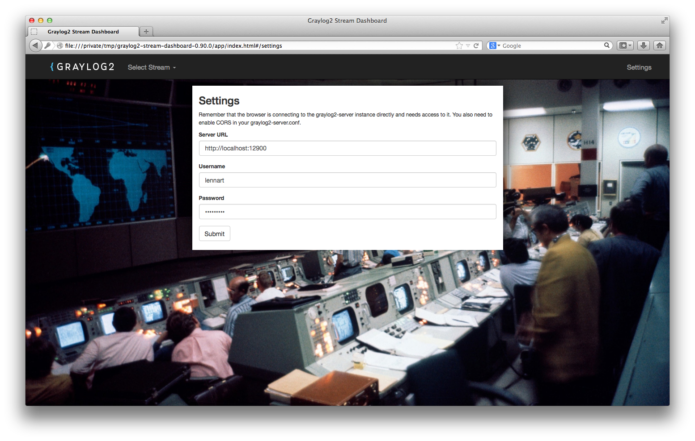
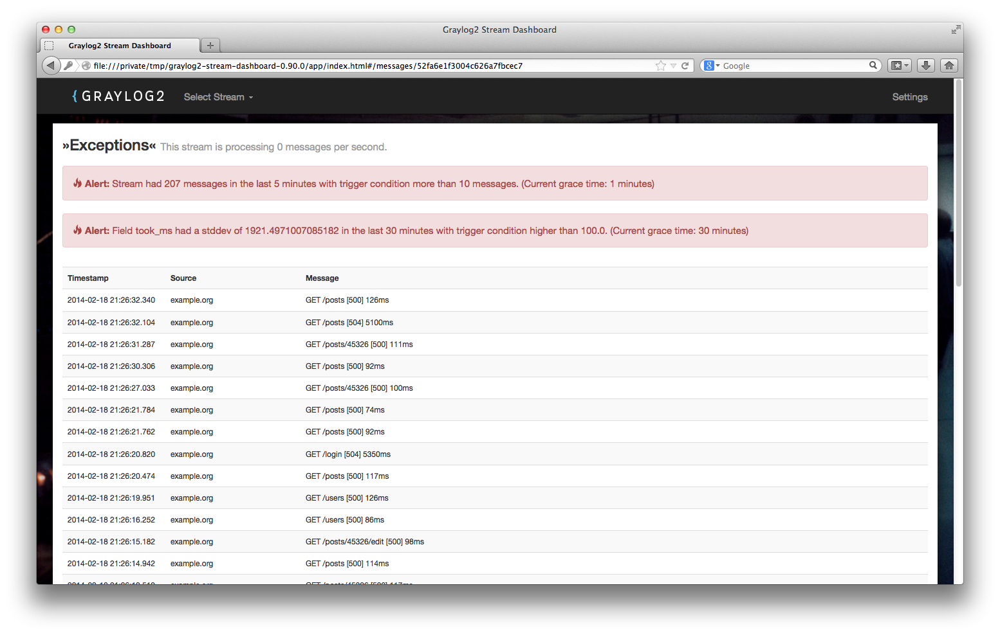

# Graylog2 Stream Dashboard

This is a small javascript web app that is showing you continuously updated dashboards for your Streams. It shows you the messages as they come in , as well as the most recent alarms that has been triggered for this stream.

Getting started for users
-------------------------

* Download the latest package from the [releases page](https://github.com/Graylog2/graylog2-stream-dashboard/releases).
* Open `app/index.html` in your browser and follow the configuration wizard to connect the stream dashboard to a `graylog2-server` node.

### Important (Read this!)

* Everything is running in your browser and your browser does AJAX calls against `graylog2-server`. This means that the browser needs direct access to the `graylog2-server` REST APIs. (Usually port 12900)
* **Google Chrome does not allow those REST connections from webpages that were opened as files from disk.** Serve the `app` folder from a simple HTTP server or use another browser. Another way for Google Chrome is to start it with `--disable-web-security`, but we obviously do not recommend that.
* You have to enable CORS support in `graylog2-server`. Put this in your `graylog2-server.conf`: `rest_enable_cors=true` ([Learn more about CORS](http://enable-cors.org/))
* This is only compatible from Graylog2 v0.20.0 (not any preview or RC versions) on.

The first setup can be as easy as this but we recommend hosting it in some webserver:

    lennart $ wget https://github.com/Graylog2/graylog2-stream-dashboard/releases/download/0.90/graylog2-stream-dashboard-0.90.0.tgz
    lennart $ tar xvfz graylog2-stream-dashboard-0.90.0.tgz
    lennart $ cd graylog2-stream-dashboard-0.90.0/app
    lennart $ open index.html

Getting started for developers
------------------------------

* Install [grunt](http://gruntjs.com) and [bower](http://bower.io)
* Run `grunt bower-install`

* Run `grunt serve` (browser window will open automatically)
OR
* Put the `app` directory on a web server of your choice
